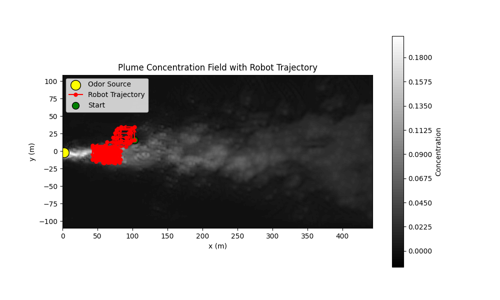

### CycleGAN
* DQN verificatio
  * [ ] DDPG Application
      * Make sure your DDPG code is correct
      * 09-24 update: I run the code and the result of reward plot and trajectory after training for 100 episodes:
        * **09-25 LX Updated**: 
          * From the diagram, it can be seen that the robot remains at the plume location and refuses to move towards the source.
  
      

### Transformer-based Time-series prediction
* [ ] Develop a transformer model to predict a time-series data. 
  * [ ] Check this [paper](./../../../Reference/Polymer%20paper.pdf)
  * Training data is located [here](./../../../../Khan/Polymer_Data/Transformer-based/).
  * Develop a Transformer-based model to predict strain based on temperature and stress. 

### Graphic Neural Network-based Polymer Prediction
* The dataset is located at [here](./../../../Polymer_Data/Graphic%20Neural%20Network-based/)
* Inside this folder, you will find the following items:
  * Data
    * autoDGEBA271-IPD
      * autoDGEBA271-IPD - 1
        * **Use time, T, Lx to predict Moving Averaged Stress**
      * autoDGEBA271-IPD - 2
        * **Use time, T, Lx to predict Moving Averaged Stress**
      * ...
    * autoDGEBA326-IPD
    * ...
  * SMILES for all SMPs
    * This is the graphic feature of all polymers
  * SMPs visualized
    * This is the sample code to visualize the polymer structures
* **Task**
  * Start with how to convert a polymer structure into GNN input. 

